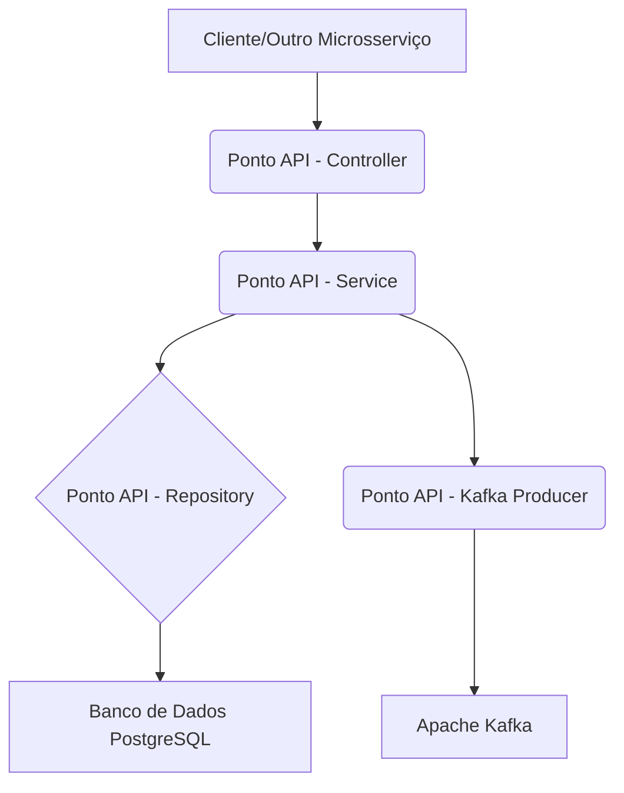

# Documentação Técnica: Microsserviço Ponto API

## 1. Introdução

Este documento técnico detalha o microsserviço "Ponto API", uma aplicação desenvolvida em Java com Spring Boot para gerenciar marcações de ponto. O objetivo é fornecer uma compreensão aprofundada de sua arquitetura, componentes, funcionalidades e as tecnologias empregadas, servindo como um guia para desenvolvedores, arquitetos e equipes de operação.

## 2. Arquitetura do Microsserviço

O Ponto API é concebido como um microsserviço, aderindo aos princípios de modularidade, escalabilidade e resiliência. Sua arquitetura é baseada em camadas bem definidas, que promovem a separação de responsabilidades e facilitam a manutenção e evolução do sistema.

### 2.1. Visão Geral da Arquitetura

O microsserviço Ponto API opera como uma unidade autônoma, responsável por uma funcionalidade específica: o registro e consulta de marcações de ponto. Ele interage com um banco de dados relacional para persistência de dados e utiliza um sistema de mensageria para comunicação assíncrona, permitindo a integração com outros serviços em um ecossistema maior.



### 2.2. Componentes Principais

O microsserviço é estruturado nos seguintes componentes:

- **Controller (`PontoController`)**: Atua como a interface de entrada para o microsserviço, expondo endpoints RESTful para o registro e consulta de pontos. Ele recebe as requisições HTTP, valida os dados de entrada e delega a lógica de negócio para a camada de serviço.
- **Service (`PontoService`)**: Contém a lógica de negócio central do microsserviço. É responsável por orquestrar as operações, interagir com o repositório para persistência de dados e com o produtor Kafka para publicação de eventos.
- **Repository (`PontoRepository`)**: Utiliza o Spring Data JPA para abstrair a complexidade do acesso ao banco de dados. Ele fornece métodos para operações CRUD (Create, Read, Update, Delete) e consultas personalizadas sobre a entidade `Ponto`.
- **Model (`Ponto`)**: Representa a entidade de domínio principal do microsserviço, mapeando a estrutura dos dados de uma marcação de ponto para o banco de dados relacional.
- **DTOs (`PontoRequest`, `PontoResponse`, `PontoEvent`)**: Objetos de Transferência de Dados que definem a estrutura dos dados que são trocados entre as camadas da aplicação e com sistemas externos. Eles garantem que apenas os dados necessários sejam expostos e que a comunicação seja clara e segura.
- **Kafka Producer (`PontoProducer`)**: Componente responsável por publicar eventos de marcação de ponto no Apache Kafka, permitindo a comunicação assíncrona e desacoplada com outros serviços que possam estar interessados nesses eventos.

## 3. Tecnologias e Versões

O microsserviço Ponto API é construído com um conjunto de tecnologias modernas e amplamente utilizadas no ecossistema de desenvolvimento de software. A seguir, detalhamos as principais tecnologias e suas versões, conforme identificado no arquivo `pom.xml` do projeto e em pesquisas complementares:

- **Java**: Versão 21 [2].
  - **Recursos Notáveis na Versão 21**: Introdução de Virtual Threads (Project Loom) para maior escalabilidade em aplicações concorrentes, Record Patterns e Pattern Matching para Switch para código mais conciso e legível, e Sequenced Collections para manipulação de coleções com ordem definida [3].
- **Spring Boot**: Versão 3.5.3 [4].
  - **Recursos Notáveis na Versão 3.5.3**: Suporte aprimorado para Java 21 e Virtual Threads, melhorias na configuração global de propriedades como timeouts e redirecionamentos para WebClient, e simplificação do Spring Boot CLI para gerenciamento de dependências e inicialização de projetos [5, 6].
- **Spring Data JPA**: Componente do Spring Framework que simplifica a implementação de camadas de acesso a dados baseadas em JPA. Ele fornece uma abstração de alto nível para interagir com bancos de dados relacionais, reduzindo a quantidade de código boilerplate [7].
- **PostgreSQL**: Sistema de gerenciamento de banco de dados relacional de código aberto. A versão utilizada é compatível com a versão 17.5, que é a mais recente beta disponível [8, 9].
- **Docker**: Plataforma de conteinerização que permite empacotar o microsserviço e suas dependências em contêineres isolados, garantindo consistência e portabilidade entre diferentes ambientes. A versão do Docker Engine é geralmente atualizada, com a versão 25.0 sendo uma das mais recentes estáveis [10, 11].
- **Apache Kafka**: Plataforma de streaming de eventos distribuída, utilizada para comunicação assíncrona entre os serviços. A versão utilizada é compatível com as versões mais recentes do Kafka [12].
- **Kafka UI**: Interface de usuário para monitoramento e gerenciamento de clusters Kafka. É uma ferramenta de código aberto que facilita a visualização de tópicos, mensagens e consumidores, auxiliando na depuração e operação do Kafka [13].
- **Lombok**: Biblioteca Java que reduz a verbosidade do código, gerando automaticamente métodos como getters, setters, construtores e outros, através de anotações [14].
- **Jakarta Validation API**: API para validação de beans, permitindo a definição de regras de validação através de anotações em classes e atributos [15].
- **Spring Kafka**: Módulo do Spring que fornece integração com o Apache Kafka, simplificando o desenvolvimento de aplicações baseadas em eventos com Kafka [16].

## 4. Explicação das Funções e Endpoints

Esta seção detalha as principais funções e endpoints expostos pelo microsserviço Ponto API, fornecendo uma visão clara de como interagir com ele e como suas operações internas são realizadas.

### 4.1. Endpoints da API

O `PontoController` expõe os seguintes endpoints RESTful sob o caminho base `/ponto`:

#### `POST /ponto`

- **Descrição**: Registra uma nova marcação de ponto.
- **Método HTTP**: `POST`
- **URL**: `/ponto`
- **Corpo da Requisição (`@RequestBody`)**: `PontoResponse` (DTO)
  ```json
  {
    "CPF": "string",
    "PIS": "string",
    "horario": "yyyy-MM-ddTHH:mm:ss"
  }
  ```
  - `CPF`: CPF do funcionário (string).
  - `PIS`: PIS do funcionário (string).
  - `horario`: Data e hora da marcação do ponto (formato ISO 8601, e.g., "2025-07-21T10:30:00").
- **Resposta (`ResponseEntity<PontoResponse>`)**: Retorna o `PontoResponse` salvo com o `NSR` gerado.
  ```json
  {
    "NSR": 12345,
    "CPF": "string",
    "PIS": "string",
    "horario": "yyyy-MM-ddTHH:mm:ss"
  }
  ```
- **Fluxo de Execução**: O `PontoController` recebe a requisição, invoca o método `registrar` do `PontoService`, que por sua vez salva o ponto no banco de dados e publica um evento no Kafka. A resposta é então retornada ao cliente.

#### `GET /ponto`

- **Descrição**: Lista todas as marcações de ponto registradas.
- **Método HTTP**: `GET`
- **URL**: `/ponto`
- **Corpo da Requisição**: Nenhum.
- **Resposta (`ResponseEntity<List<PontoResponse>>`)**: Retorna uma lista de `PontoResponse` contendo todas as marcações de ponto.
  ```json
  [
    {
      "NSR": 12345,
      "CPF": "string",
      "PIS": "string",
      "horario": "yyyy-MM-ddTHH:mm:ss"
    },
    {
      "NSR": 67890,
      "CPF": "string",
      "PIS": "string",
      "horario": "yyyy-MM-ddTHH:mm:ss"
    }
  ]
  ```
- **Fluxo de Execução**: O `PontoController` recebe a requisição, invoca o método `listarTodos` do `PontoService`, que recupera todos os pontos do banco de dados e os mapeia para `PontoResponse` antes de retornar a lista ao cliente.

### 4.2. Funções Internas Principais

#### `PontoService.registrar(PontoResponse dto)`

- **Descrição**: Responsável por processar o registro de uma nova marcação de ponto.
- **Parâmetros**: `PontoResponse dto` - DTO contendo os dados da marcação de ponto.
- **Retorno**: `PontoResponse` - O DTO do ponto salvo, incluindo o NSR gerado.
- **Detalhes da Implementação**:
  1.  Converte o `PontoResponse` de entrada para a entidade `Ponto`.
  2.  Persiste a entidade `Ponto` no banco de dados através do `PontoRepository.save()`.
  3.  Cria um `PontoEvent` com os dados do ponto salvo.
  4.  Publica o `PontoEvent` no Apache Kafka utilizando o `PontoProducer.enviarEvento()`.
  5.  Retorna o `PontoResponse` do ponto salvo.

#### `PontoService.listarTodos()`

- **Descrição**: Recupera todas as marcações de ponto existentes no banco de dados.
- **Parâmetros**: Nenhum.
- **Retorno**: `List<PontoResponse>` - Uma lista de DTOs de marcações de ponto.
- **Detalhes da Implementação**:
  1.  Busca todas as entidades `Ponto` no banco de dados utilizando `pontoRepository.findAll()`.
  2.  Mapeia cada entidade `Ponto` para um `PontoResponse`.
  3.  Retorna a lista de `PontoResponse`.

#### `PontoProducer.enviarEvento(PontoEvent evento)`

- **Descrição**: Envia um evento de marcação de ponto para um tópico específico no Apache Kafka.
- **Parâmetros**: `PontoEvent evento` - O evento de ponto a ser enviado.
- **Retorno**: `void`.
- **Detalhes da Implementação**: Utiliza a funcionalidade do Spring Kafka para enviar a mensagem para o broker Kafka. Este método é crucial para a comunicação assíncrona e a integração com outros sistemas que consomem eventos de ponto.

## 5. Configuração e Implantação

Esta seção aborda aspectos importantes para a configuração e implantação do microsserviço Ponto API.

### 5.1. Variáveis de Ambiente e Configurações

As configurações do aplicativo são gerenciadas principalmente através do arquivo `application.properties` (localizado em `src/main/resources/application.properties`). Este arquivo pode conter configurações para o banco de dados, Kafka, portas da aplicação, entre outros.

Exemplo de configurações comuns:

```properties
spring.datasource.url=jdbc:postgresql://localhost:5432/ponto_db
spring.datasource.username=user
spring.datasource.password=password
spring.jpa.hibernate.ddl-auto=update
spring.kafka.bootstrap-servers=localhost:9092
```

Para ambientes de produção, é recomendável utilizar variáveis de ambiente ou um serviço de configuração centralizado para gerenciar essas propriedades de forma segura e flexível.

### 5.2. Implantação com Docker e Docker Compose

O projeto inclui um arquivo `compose.yaml` que facilita a implantação do microsserviço Ponto API, juntamente com suas dependências (PostgreSQL e Kafka/Kafka UI), utilizando Docker Compose.

```yaml
# Exemplo simplificado de compose.yaml
version: "3.8"
services:
  pontoapi:
    build: .
    ports:
      - "8080:8080"
    environment:
      - SPRING_DATASOURCE_URL=jdbc:postgresql://postgres:5432/ponto_db
      - SPRING_DATASOURCE_USERNAME=user
      - SPRING_DATASOURCE_PASSWORD=password
      - SPRING_KAFKA_BOOTSTRAP_SERVERS=kafka:9092
    depends_on:
      - postgres
      - kafka

  postgres:
    image: postgres:17.5-alpine
    environment:
      - POSTGRES_DB=ponto_db
      - POSTGRES_USER=user
      - POSTGRES_PASSWORD=password
    ports:
      - "5432:5432"

  kafka:
    image: confluentinc/cp-kafka:7.5.0
    ports:
      - "9092:9092"
      - "29092:29092"
    environment:
      - KAFKA_BROKER_ID=1
      - KAFKA_ZOOKEEPER_CONNECT=zookeeper:2181
      - KAFKA_ADVERTISED_LISTENERS=PLAINTEXT://kafka:9092
    depends_on:
      - zookeeper

  zookeeper:
    image: confluentinc/cp-zookeeper:7.5.0
    ports:
      - "2181:2181"
    environment:
      - ZOOKEEPER_CLIENT_PORT=2181

  kafka-ui:
    image: provectus/kafka-ui:latest
    ports:
      - "8081:8080"
    environment:
      - KAFKA_CLUSTERS_0_NAME=local
      - KAFKA_CLUSTERS_0_BOOTSTRAPSERVERS=kafka:9092
      - KAFKA_CLUSTERS_0_ZOOKEEPER=zookeeper:2181
    depends_on:
      - kafka
```

Para iniciar o ambiente, basta executar o comando `docker compose up -d` no diretório raiz do projeto. Isso construirá as imagens, criará os contêineres e iniciará todos os serviços necessários.

## 6. Considerações Finais

O microsserviço Ponto API é um exemplo claro de como a arquitetura de microsserviços pode ser aplicada para construir sistemas modulares e eficientes. A combinação de Spring Boot, Spring Data JPA, PostgreSQL, Kafka e Docker oferece uma base robusta para o desenvolvimento de aplicações distribuídas. A documentação aqui apresentada visa fornecer um ponto de partida sólido para qualquer pessoa que deseje entender, manter ou estender este microsserviço.

## Referências

[1] Repositório GitHub do Ponto API. Disponível em: [https://github.com/pedrosa-hr-hub/ponto_api](https://github.com/pedrosa-hr-hub/ponto_api)
[2] Java 21 Features. Disponível em: [https://www.baeldung.com/java-lts-21-new-features](https://www.baeldung.com/java-lts-21-new-features)
[3] New Features in Java 21. Disponível em: [https://www.geeksforgeeks.org/java/java-jdk-21-new-features-of-java-21/](https://www.geeksforgeeks.org/java/java-jdk-21-new-features-of-java-21/)
[4] Spring Boot 3.5.3 Release. Disponível em: [https://spring.io/blog/2025/06/19/spring-boot-3-5-3-available-now/](https://spring.io/blog/2025/06/19/spring-boot-3-5-3-available-now/)
[5] Top 6 features of Spring Boot 3.5. Disponível em: [https://medium.com/threadsafe/top-6-features-of-spring-boot-3-5-ae0b38a7822a](https://medium.com/threadsafe/top-6-features-of-spring-boot-3-5-ae0b38a7822a)
[6] Spring Boot 3.5.3 Benchmark. Disponível em: [https://itnext.io/spring-boot-3-5-3-benchmark-web-reactive-cds-aot-virtual-threads-jvm-and-native-87baf806c5bc](https://itnext.io/spring-boot-3-5-3-benchmark-web-reactive-cds-aot-virtual-threads-jvm-and-native-87baf806c5bc)
[7] Spring Data JPA. Disponível em: [https://spring.io/projects/spring-data-jpa](https://spring.io/projects/spring-data-jpa)
[8] PostgreSQL Latest Version. Disponível em: [https://www.postgresql.org/about/](https://www.postgresql.org/about/)
[9] PostgreSQL 18 Beta 2 Released. Disponível em: [https://www.postgresql.org/about/news/postgresql-18-beta-2-released-2830/](https://www.postgresql.org/about/news/postgresql-18-beta-2-released-2830/)
[10] Docker Engine Release Notes. Disponível em: [https://docs.docker.com/engine/release-notes/](https://docs.docker.com/engine/release-notes/)
[11] Docker Desktop Release Notes. Disponível em: [https://docs.docker.com/desktop/release-notes/](https://docs.docker.com/desktop/release-notes/)
[12] Apache Kafka. Disponível em: [https://kafka.apache.org/](https://kafka.apache.org/)
[13] Kafka UI GitHub. Disponível em: [https://github.com/provectus/kafka-ui](https://github.com/provectus/kafka-ui)
[14] Project Lombok. Disponível em: [https://projectlombok.org/](https://projectlombok.org/)
[15] Jakarta Validation. Disponível em: [https://jakarta.ee/specifications/bean-validation/](https://jakarta.ee/specifications/bean-validation/)
[16] Spring for Apache Kafka. Disponível em: [https://spring.io/projects/spring-kafka](https://spring.io/projects/spring-kafka)
